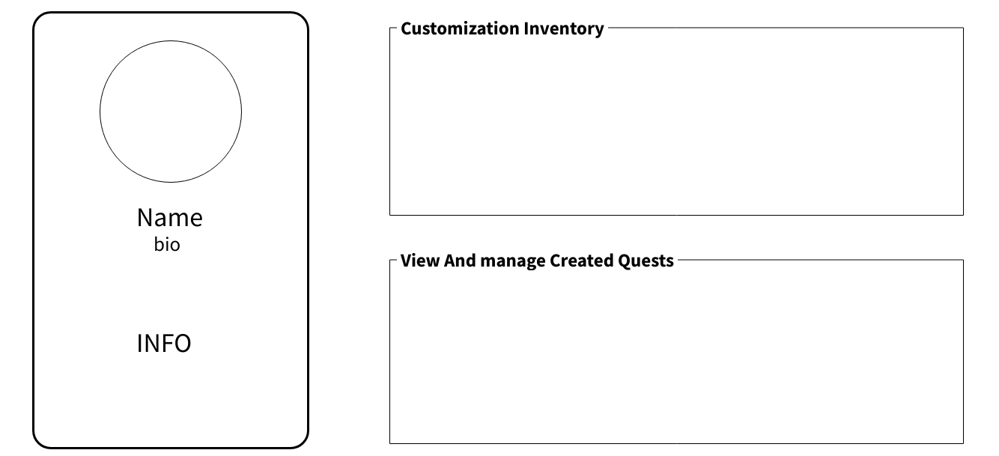
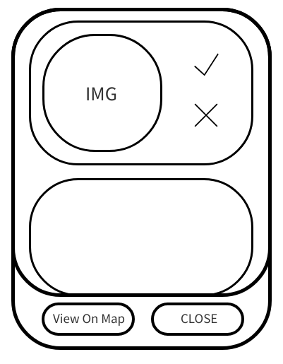
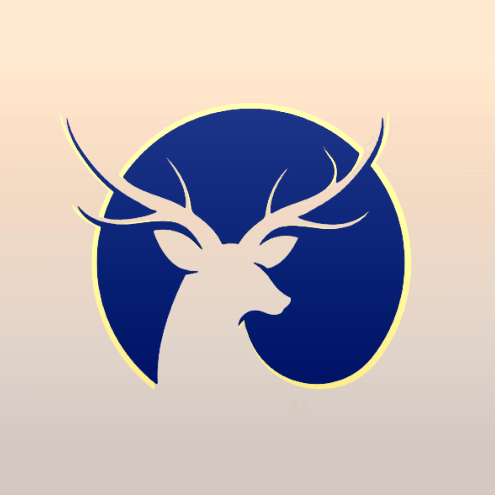
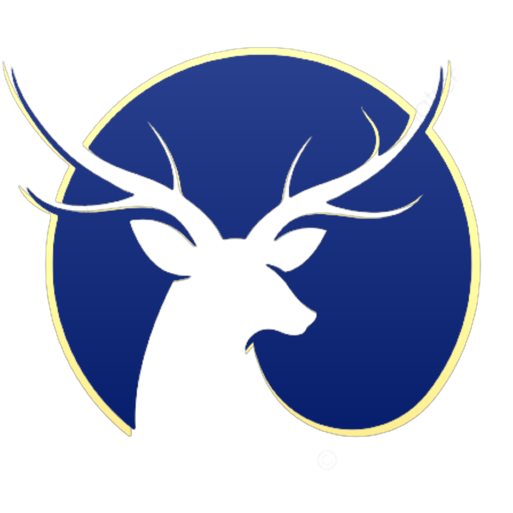

## 🎨 Color Scheme

The website uses a **variety of brown and light beige** shades to create a fantasy aesthetic.

## 🖼 Mockups

  

    
    

      Homepage Mockup
    

  

  

    
    

      Profile Mockup
    

  

  

    
    

      ManageQuest Mockup
    

  

## 📚 Resources

  

    
    

      Wits Adventure Logo
    

  

  

    
    

      Alpha Version
    

  

## 🧝 Emoji Catalogue

🗡️ ⚔️ 🛡️ 🐉 🧙‍♂️ 🏰 📜 🗺️ 💰 👑 💀 🧪 🪓 🏹 🧝 🧚‍♀️ 🔮 🗝️ 🔥 🪄 🕸️
🪙 🌟 🪶 🍄 🦄 🏺 🧟 ⚗️ ⛲ 🪨 🍷 🕯️ 📯 🪤 🧭 🔔 🧿 💎 🔱 🦅 🦇 🐺 🤴 👸 🤺 🦉 🪃 ⛏️
🌙 ☀️ 🌪️ ☄️ ✨ 🧜‍♀️ 🧞‍♂️ 🧌 🧝‍♀️ 🧛‍♂️ 🧚‍♂️ 🎇 🧺 🏔️ 🌲 ⚡  ⚒ ⚖️ 🖼  🪞 🐈‍⬛ 🐍 🐲 💫 ❄️ 🎁 ⛓️ 👩‍🎤 

## 🧭 Quest Design

### 🗺️ Journey Quests

Equivalent to treasure hunts, but I prefered this name.

**Concept:**

- Quest attempter is given **pictures of locations** and an **accompanying riddle** for each one.
- Instead of scannables (which could become litter), quests are completed by submitting locations.
- Users verify progress by tapping a button on-location → no admin approval needed.
- Checkpoints don't have a search radius, except for the **final location** in the chain.

**Process (Quest Maker):**

1. Initialize a new journey quest (creates database entry).
2. Select physical checkpoint locations, and for each:
   - Upload riddle.
   - Upload an **image** (riddle-related hint).
3. Publish the quest.

**Process (User):**

1. Accept the quest.
2. Travel to each location, solving riddles.
3. Unlock the next checkpoint once the current one is completed.
4. Complete the final location for full reward.

**Notes:**

- These quests should offer **higher point rewards** than user-made location quests.
- Not time-limited or restricted to single users.
- Could tie into **Wits history** or lore for added depth.

---

### 📍 Location Quests

Made by users and focused on individual locations.

**Concept:**

- Quest maker uploads a **picture** and a **title/riddle**.
- Completed by visiting the location and **taking a picture**.
- Completed pictures can become **collectibles** on user profiles (like explorer journals).

**Process (Quest Maker):**

1. Select the goal location.
2. Upload **Riddle or hint** (optionally with image → lowers reward).
3. Set a **quest radius**.
4. Publish the quest.

**Process (User):**

1. View quest radius + riddle/hints.
2. Travel to location.
3. Take and submit a **solution image**.
4. Quest maker reviews submission.
5. Upon approval:
   - Quest becomes inactive/delisted.
   - User receives points.

**Rewards:**

1. The quest completer earns more gold for completing quests that have a bigger search area, since finding the goal would be more difficult. An additional slider could be added for more difficulty tweaking upon quest creation
2. Upon quest completion the quest creator receives the same amount of gold, to incentivise quest creation.

## 🪙 Rewards system

- Users get gold for completing quests.
- Gold earnt contributes to the leaderboad ranking, which periodically resets and might have rewards for the top performers.
- Gold can be used to buy cosmetics.
- Achievements/badges are received based on total gold earnt
- Spending gold doesn't affect total gold earnt or your leaderboard ranking

---

## 💻 API

We are using the HTML Geolocation API because it provides a simple, built-in way to access the user’s current location directly through the browser without needing any external services. This makes it lightweight, easy to implement, and available across most modern devices and browsers which is perfect for our project where location data is central to completing quests. Unlike third-party APIs such as Google Maps Geolocation, the HTML Geolocation API does not require an API key, extra billing setup, or network requests to external providers for basic location access. This reduces cost, improves privacy since the location data is only shared locally with the browser and keeps the project more maintainable. For our use case, checking whether users are within a certain radius of a quest location, the HTML Geolocation API gives us all the accuracy and functionality we need without unnecessary overhead.
