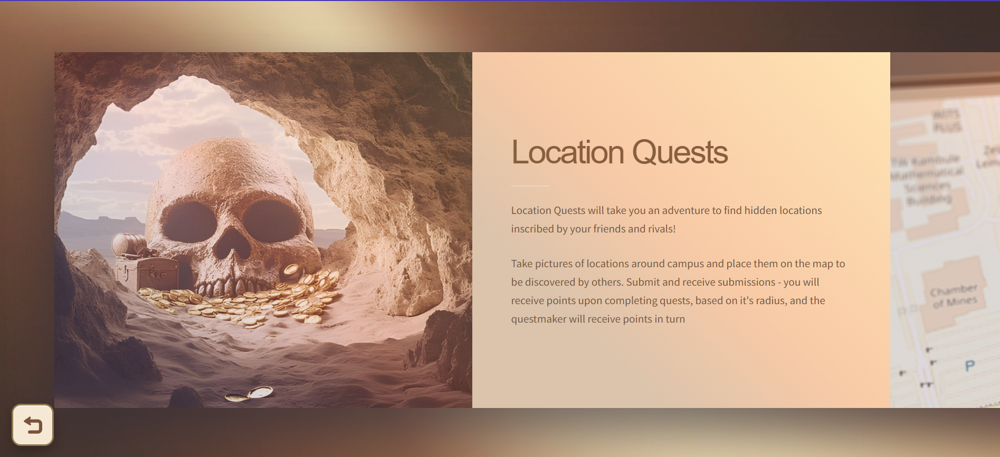
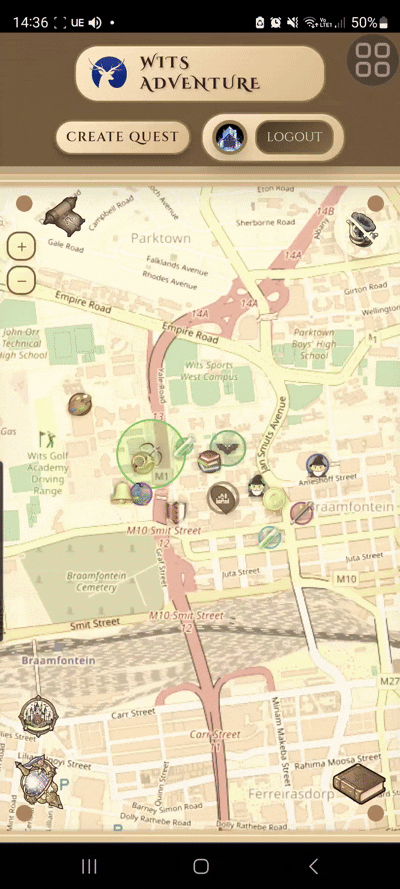
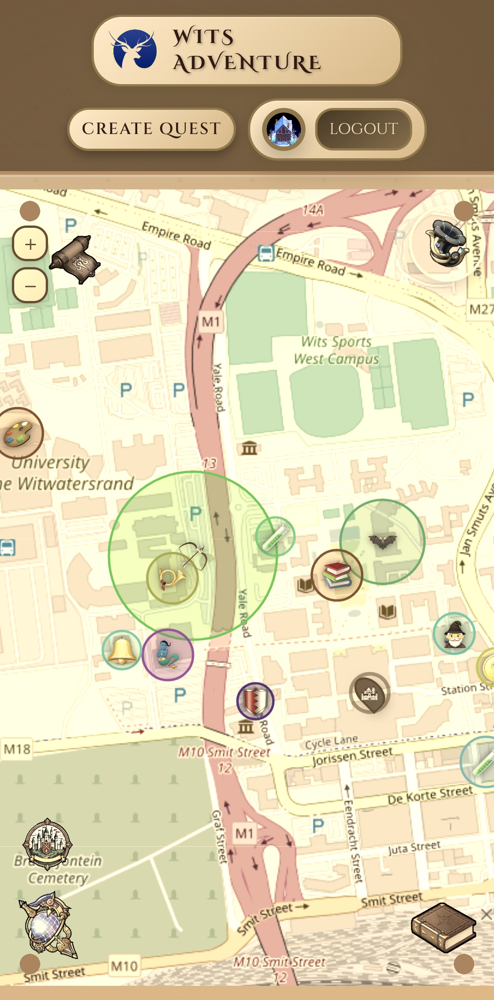

# User Feedback & Improvements

This document tracks user feedback and the improvements we've implemented based on their suggestions.

## 1. Quest Tutorial

**Feedback/Problem:** Users weren't sure how quests worked.

**Improvement:**
Added a tutorial page to explain how each quest works.

*Tutorial page explaining location and Journey Quests, and bell functionality*

## 2. Bell location tracking

**Feedback/Problem:** The map didn't let you know where you were, this made journey quests especially difficult to complete.

**Improvement:**
The bell now centres the map on the users location.

## 3. Better mobile responsiveness

**Feedback/Problem:** Users complained that the site doesn't feel responsive on mobile

**Improvement:**
Made visuals and input fields scale better on mobile.

