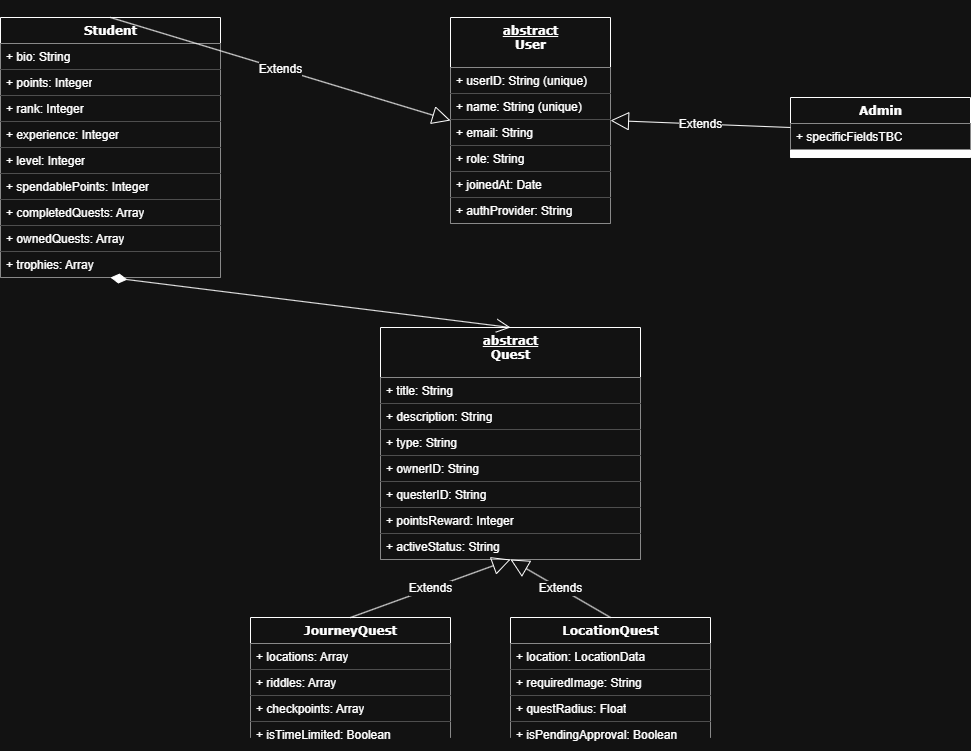

# Data Schema

This document outlines the proposed database schema for users and quests.

---

## Users Collection

Each document is indexed by the user's `userID`.  
This collection stores all user-related data.

### **Common Fields**
- `userID`: *string* — A unique identifier.
- `email`: *string* — The user's email.
- `role`: *string* — `"student"` or `"admin"`.
- `name`: *string* — The user's unique display name.
- `authProvider`: *string* — The method used for authentication.
- `joinedAt`: *timestamp* — The account creation date.

### **Student-Specific Fields**
- `bio`: *string* — Profile biography.
- `points`: *number* — Points for the current leaderboard cycle (resettable).
- `rank`: *number* — Leaderboard position based on points.
- `experience`: *number* — A cumulative total of all points (never resets).
- `level`: *number* — Based on experience.
- `spendablePoints`: *number* — For profile customizations.
- `completedQuests`: *array<string>* — IDs of completed quests.
- `ownedQuests`: *array<string>* — IDs of quests created by this user.
- `trophies`: *array* — A list of unique achievements.

---

## Quests Collection

Each quest is a document in the Quests collection.  
The quest schema varies based on the `type` field.

### **Common Fields (all types)**
- `title`: *string*
- `description`: *string*
- `type`: *string* — `"location"` or `"journey"`
- `creatorId`: *string* — The `userID` of the creator.
- `reward`: *number* — Points awarded for completion.
- `status`: *string* — `pending_approval`, `active`, `completed`, or `timed_out`.
- `createdAt`: *timestamp* — The creation date.
- `completedAt`: *timestamp* — (Optional) The completion date.
- `acceptedBy`: *array<string>* — User IDs who have accepted the quest.

### **Location Quest-Specific Fields**
- `location`: *GeoPoint* — The geographic coordinates.
- `searchRadius`: *number* — The radius (in meters) for verification.
- `hintImageURL`: *string* — A URL for the image hint.
- `riddle`: *string* — The quest riddle.
- `collectedImages`: *array<object>* — Submitted images for completion.

### **Journey Quest-Specific Fields**
- `checkpoints`: *array<object>* — A chain of checkpoints, each containing:
  - `hintImageURL`: *string*
  - `riddle`: *string*
  - `location`: *GeoPoint*

---

