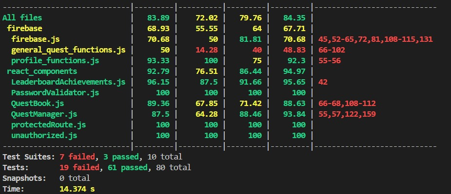

# Testing Overview

This document summarizes the main test files and their purposes in the project.

---

## Test Files

1. **firebase.test.js**
   - Verifies Firebase integration (authentication, Firestore, and other Firebase utilities).
   - Ensures correct initialization and interaction with Firebase services.

2. **general_quest.test.js**
   - Tests generic quest functionality.
   - Covers quest creation, validation, progress tracking, and completion logic.

3. **Home.test.js**
   - Unit tests for the Home component/page.
   - Checks rendering, navigation links, and conditional UI behavior.

4. **LeaderboardAchievements.test.js**
   - Validates leaderboard and achievements logic.
   - Ensures users are ranked correctly and achievements are awarded.

5. **PasswordValidator.test.js**
   - Tests password validation rules (length, complexity, special characters).
   - Ensures weak passwords are rejected and strong passwords are accepted.

6. **profileFunctions.test.js**
   - Verifies functions related to user profiles.
   - Covers updating profile details, fetching user info, and profile-related validations.

7. **ProtectedRoutes.test.js**
   - Ensures only authenticated users can access certain routes.
   - Tests redirects to login or unauthorized pages when access is denied.

8. **QuestBook.test.js**
   - Tests the QuestBook component.
   - Ensures quests display correctly, filtering/sorting works, and user interactions function as expected.

9. **QuestManager.test.js**
   - Tests the quest management logic.
   - Covers assigning quests, updating progress, and marking completion.

10. **unauthorized.test.js**
    - Tests unauthorized access handling.
    - Ensures users without proper access see the correct Unauthorized component/page.

---

## Running the Tests

Make sure you have Jest installed (it usually comes with React projects or can be installed manually):

```bash
npm install --save-dev jest @testing-library/react @testing-library/jest-dom
```

To run all tests:

```bash
npm test
```

### Example Output

When you run `npm test`, you should see output similar to the following:

